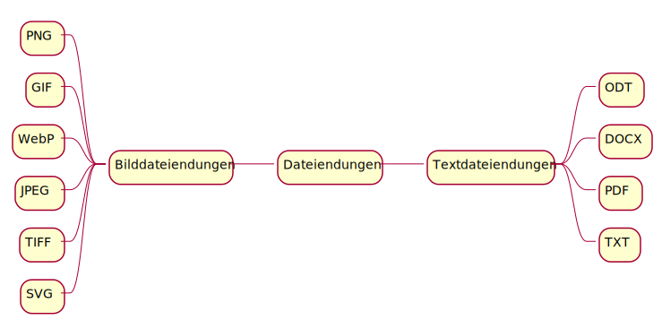

Dateiendungen
=============

Auf dieser Seite sehen Sie eine kleine Übersicht zu existierenden Dateiformaten.

.. glossary::
    **Bilddateiendungen**
    PNG (Portable Network Graphics)
        Verlustfreie Kompression \n
        Pixel-basiert
        Farbräume: RGB, indizierte Farben, Graustufen, Bitmap
        Farbtiefe bis 16 Bit
        Transparenz möglich
    
    GIF (Graphics Interchange Format)
        Pixel-basiert
        Kompression mittels LZW
        Unterstützt 256 Farben, sowie Transparenz.

    WebP
        Verlustbehaftet oder -frei komprimiertes statisches oder animiertes Bild
        Unterstützt nur 4:2:0 Farbabtastung
    
    JPEG (Joint Photographic Experts Group)
        Pixel-basiert
        Farbräume: RGB, CMYK, Graustufen
        Farbtiefe: bis 8 Bit/Kanal
        Transparenz nicht möglich

    TIFF (Tagged Image File Format)
        Verlustfreie Komprimierung
        Pixel-basiert
        Farbräume: RGB, CMYK, LAB, Graustufen, Bitmap, Duplex, Sonderfarben
        Farbtiefe: bis 32 Bit/Kanal
        Transparenz möglich

    SVG (Scalable Vector Graphics)
        Skalierbar ohne Qualitätsverlust
        Vektor-basiert
        Unterliegt XML Syntax
        Nicht Pixel sondern Pfade werden abgespeichert
    
    **Textdateiendungen**
    ODT (OpenDocument Text)
        Teil des OpenDocument Format, basiert auf XML
        Dateien können Texte, Bilder, Grafiken, Tabellen, Makros und Formatierungen enthalten
        Von LibreOffice sowie OpenOffice verwendet

    DOCX
        Von Microsoft entwickelt, basiert auf xml
        Dateien können Texte, Bilder, Grafiken, Tabellen und Formatierungen enthalten
        Von Word verwendet

    PDF (Portable Document Format)
        Von Adobe entwickelt
        Ergebnis ist überall gleich
        Adobe Acrobat Reader kann diese Dateien öffnen

    TXT
        Text wird plain, also ohne Formatierung gespeichert
        Kann von sehr vielen Sachen geöffnet werden

