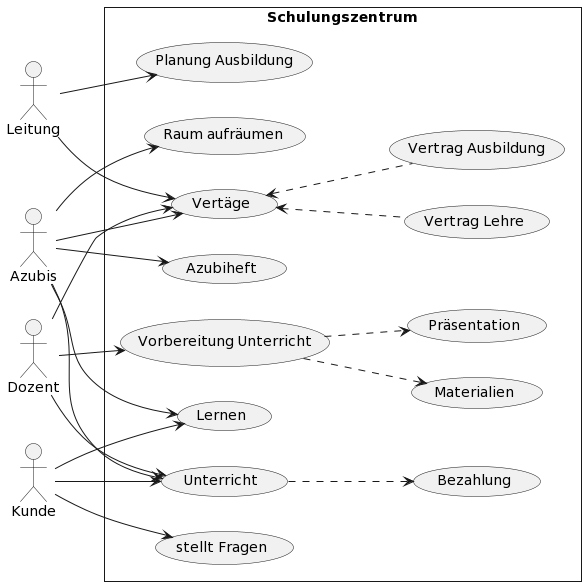

Anwendungsfalldiagramme
=======================
.. index:: Anwendungsfalldiagramme
.. index:: use-case diagram

Anwendungsfalldiagramme, auch use-case-Diagramme genannt, zeigen das 
zu modellierende System aus der Sicht der Anwender.

Quellcode zum obigen Bild, generiert über: 

https://plantuml.com/de/use-case-diagram

.. literalinclude:: ./Files/uml_text.txt

Das folgende Bild zeigt eine Prügungsaufgabe zum Anwendungsfalldiagramm:

.. image:: ./Images/uml-prüfung.png